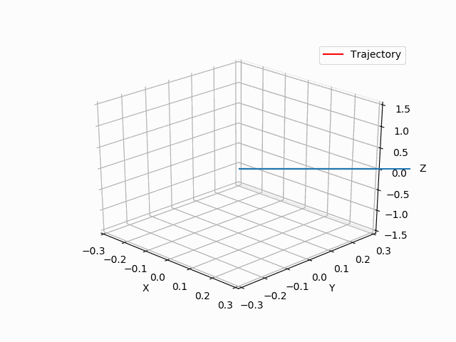
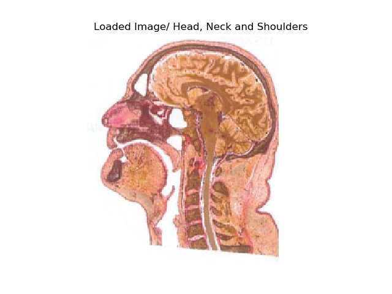
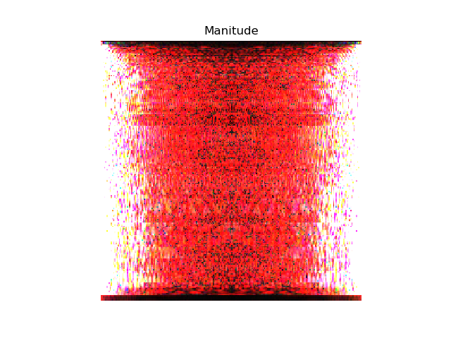
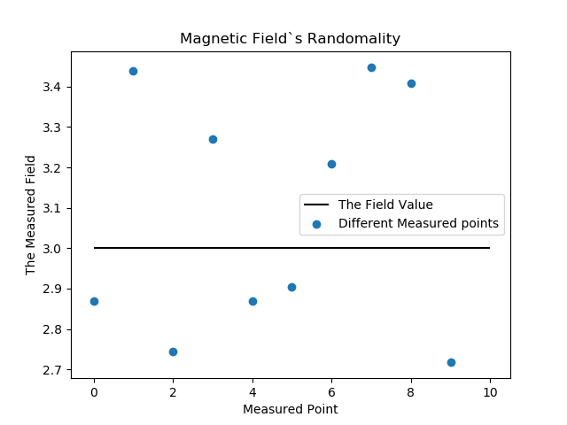

# Bloch Equation Simulation 

### An implementation of Bloch equations that describes the behavior of the bulk magnetization 

Main importations


```python
import bloch as b  # a Class which is implemented in it`s own module 
import numpy as np
from matplotlib.animation import FuncAnimation
import mpl_toolkits.mplot3d.axes3d as p3
from matplotlib import animation
import matplotlib.pyplot as plt
%matplotlib notebook
%matplotlib notebook
```

##### instantiation of the main class responsible for the calculations needed and printing the accompanied doc string 

###### the file can be tracked here [Bloch](bloch.py)


```python
m = b.magentization(900*10**-3, 50*10**-3, 1.5)
print(b.magentization.__doc__)
```


        Responsible for calculating the magnetization vector.
        Implements the following:
        * calculate the magnetization vector after application of Mo [0 0 Mo]
        * Returns the vector into its relaxation state


#### we searched for T1 and T2 values for different tissues and found many results 

##### the values we tried are from this [link](https://mri-q.com/why-is-t1--t2.html)


#### applied an RF pulse for 1 sec 


```python
m.rotate(1)
print(m.rotate.__doc__)
```


            Rotates the magnetization vector by application of an RF pulse for a given time t
            ================== =================================================
            **Parameters**
            t                  Time in seconds
            ================== =================================================


## plotting 

### The following chunk of code is responsible for making an animation of the bulk magnetization\`s trajectory 

- using matplotlib funcAnimation and quiver for 3d plotting 
- the plot is initialized with the first values returned from the rotations of the vector 
- an update function is given for FuncAnimation which updates the plot\`s data with the next value to show in the next frame 


```python
fig = plt.figure()
ax = fig.gca(projection='3d')

# Origin
x, y, z = (0, 0, 0)

# Directions of the vector 
u = m.vector[0, 0]  # x Component 
v = m.vector[0, 1]  # y Component
w = m.vector[0, 2]   # z Component 

quiver = ax.quiver(x, y, z, u, v, w, arrow_length_ratio=0.1, color="red")
ax.plot(m.vector[:0, 0], m.vector[:0, 1], m.vector[:0, 2], color='r', label="Trajectory")

def update(t):
    global quiver
    u = m.vector[t, 0]
    v = m.vector[t, 1]
    w = m.vector[t, 2]
    quiver.remove()
    quiver= ax.quiver(x, y, z, u, v, w, arrow_length_ratio=0.1)
    ax.plot(m.vector[:t, 0], m.vector[:t, 1], m.vector[:t, 2], color='r', label="Trajectory")
    
ax.set_xlim3d([-0.3, 0.3])
ax.set_xlabel('X')

ax.set_ylim3d([-0.3, 0.3])
ax.set_ylabel('Y')

ax.set_zlim3d([-1.5, 1.5])
ax.set_zlabel('Z')

ax.view_init(elev= 0.9, azim=-45)
ani = FuncAnimation(fig, update, frames=np.arange(0, 100), interval=200, blit= True)
ax.legend()
ani.save("magnetization.gif")
plt.show()
```

##### Note : the animation is interactive on Jupyter

### the [Animation](magnetization.gif)


​	


### Third Part 

#### Applying Fourier Transform on an image 

###### importing a class made for the [image's](image.py) loading and performing Fourier transform 


```python
import image  # a class for image`s processes 
```


```python
imageSlice = image.image()
print(image.image().__doc__)
```


        Responsible for all interactions with images.
        Implements the following:
        * Loading the image data to the class
        * Apply Fourier Transformation to the image
        * Extract the following components from the transformations :
            - Real Component
            - Imaginary Component
            - Phase
            - Magnitude


```python
imageSlice.loadImage("78146.png", greyScale=False)
print(imageSlice.loadImage.__doc__)
```

    the image loaded shape is  (230, 230, 3)
    
            Implements the following:
            * Loading the image from specified path
            * Normalize the image values
            ================== =============================================================================
            **Parameters**
            Path               a string specifying the absolute path to image, if provided loads this image
                               to the class`s data
            data               numpy array if provided loads this data directly
            fourier            numpy array if provided loads the transformed data
            imageShape         a tuple of ints identifying the image shape if any method is used except using
                               path
            greyScale          if True the image is transformed to greyscale via OpenCV`s convert image tool
            ================== =============================================================================

##### Showing the image loaded 


```python
fig2 = plt.figure()
plt.title("Loaded Image/ Head, Neck and Shoulders")
plt.axis("off")
plt.imshow(imageSlice.imageData)
```



### the following are a plots if the image\`s Fourier transform magnitude and phase components 


```python
imageSlice.fourierTransform()
fig3 = plt.figure()
plt.title("Manitude")
plt.axis("off")
plt.imshow(imageSlice.magnitude())
```




```python
fig4 = plt.figure()
plt.title("Phase")
plt.axis("off")
plt.imshow(imageSlice.phase())
```


```python
print("Function`s description")
print("imageSlice.fourierTransform: ")
print(imageSlice.fourierTransform.__doc__)
print("imageSlice.magnitude:")
print(imageSlice.magnitude.__doc__)
print("imageSlice.phase: ")
print(imageSlice.phase.__doc__)
```

    Function`s description
    imageSlice.fourierTransform: 
    
            Applies Fourier Transform on the data of the image and save it in the specified attribute
            ================== ===========================================================================
            **Parameters**
            shifted            If True will also apply the shifted Fourier Transform
            ================== ===========================================================================
            
    imageSlice.magnitude:
    
            Extracts the image`s Magnitude Spectrum from the image`s Fourier data
            ================== ===========================================================================
            **Parameters**
            LodScale           If True returns 20 * np.log(ImageFourier)
            ================== ===========================================================================
            **Returns**
            array              a numpy array of the extracted data
            ================== ===========================================================================
            
    imageSlice.phase: 
    
            Extracts the image`s Phase Spectrum from the image`s Fourier data
            ================== ===========================================================================
            **Parameters**
            shifted           If true applies a phase shift on the returned data
            ================== ===========================================================================
            **Returns**
            array              a numpy array of the extracted data
            ================== ===========================================================================


​    


### Fourth Part 

#### Visualizing the Field\`s in-uniformity  


```python
field = 3.0  # Tesla 
delta = 0.5
```


```python
Bz = np.random.uniform(field-delta, field+delta, size=10)
```


```python
fig5 = plt.figure()
plt.title("Magnetic Field`s Randomality")
plt.xlabel("Measured Point")
plt.ylabel("The Measured Field")
plt.hlines(3,0, 10, label="The Field Value")
plt.scatter(range(0, 10), Bz, label="Different Measured points")
plt.legend()
```



